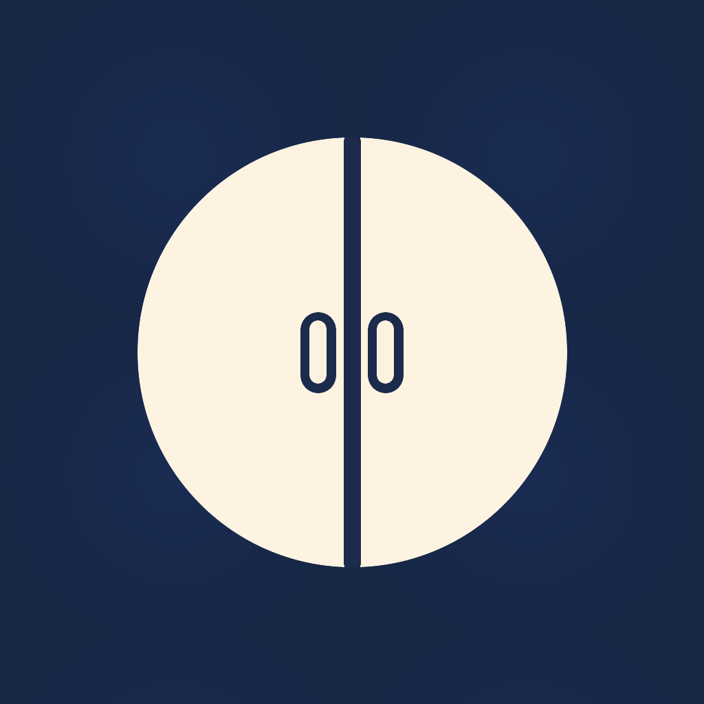
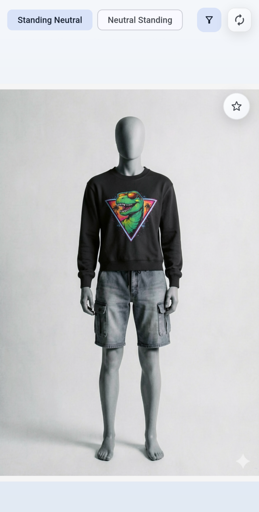
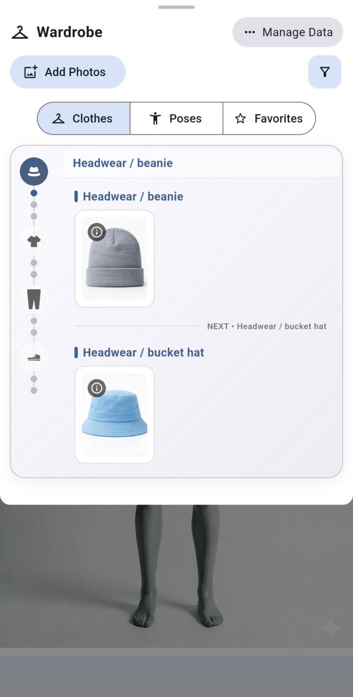
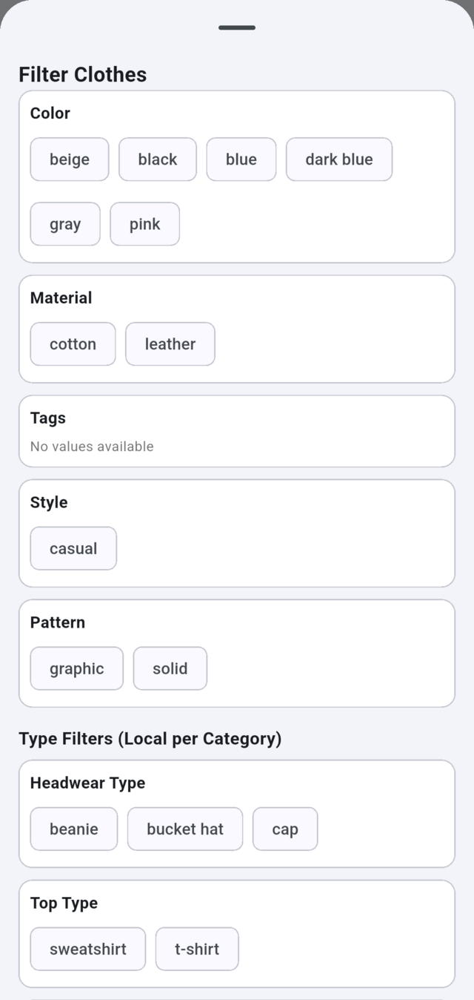
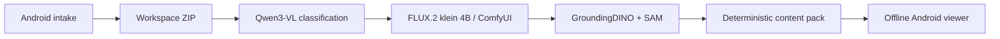

<p align="center">
  
</p>

<h1 align="center">Wardrobe</h1>

<p align="center">
  An offline-first Android outfit viewer with a fully local FLUX.2 image-editing pipeline.
</p>

Wardrobe turns photos of a pose and individual garments into a browsable outfit
collection. The Android app handles intake, portable workspace ZIPs, and offline
browsing. A Python CLI classifies clothing with Qwen3-VL, drives FLUX.2 [klein]
4B through ComfyUI, extracts accessory overlays with GroundingDINO and Segment
Anything, and packages the result back into the app.

The repository contains only synthetic demo images. No API keys, cloud backend,
personal photos, or model weights are required to explore the Android app.

<p align="center">
  
  
  
</p>

## Try the Android app

The [v0.1.0 release](https://github.com/HemerFabian/wardrobe/releases/tag/v0.1.0)
contains a signed universal Android APK with the synthetic wardrobe already
bundled. Download the APK and `SHA256SUMS.txt`, then verify it before installing:

```bash
sha256sum --check SHA256SUMS.txt
```

Android will ask you to allow installation from the browser or file manager.
The APK is distributed directly through this repository rather than Google
Play. Its release notes include the signing-certificate fingerprint used to
identify future updates.

To run from source instead, install Flutter 3.38.9 and an Android SDK:

```bash
cd apps/wardrobe_flutter
flutter pub get
flutter run
```

## Product flow

- Capture poses and clothing references on Android.
- Export or import a self-contained workspace ZIP.
- Classify new intake locally with Qwen3-VL through Ollama.
- Generate top and bottom combinations with FLUX.2 [klein] 4B in ComfyUI.
- Extract transparent headwear and shoe overlays with GroundingDINO and SAM.
- Browse outfits, filters, favorites, edits, and regeneration requests offline.



The classifier and image generator are separate: Qwen3-VL describes intake
images, while [FLUX.2 [klein] 4B](https://huggingface.co/black-forest-labs/FLUX.2-klein-4b-fp8)
performs all generative image editing. The bundled workflow is derived from the
[official ComfyUI FLUX.2 guide](https://docs.comfy.org/tutorials/flux/flux-2-klein)
and uses the distilled four-step model.

## Run the full local AI pipeline

Prerequisites:

- Python 3.11 or newer and [`uv`](https://docs.astral.sh/uv/)
- Ollama with `qwen3-vl:8b-instruct-q4_K_M`
- a current ComfyUI installation
- the three FLUX.2 model files listed below
- the SAM ViT-H checkpoint and GroundingDINO cache
- an NVIDIA GPU is strongly recommended; 8 GB VRAM is a tight lower bound with
  ComfyUI offloading, and more VRAM improves reliability
- approximately 20–30 GB free for the documented models, Python environment,
  and working outputs

```bash
uv sync --dev --extra ml --locked
ollama pull qwen3-vl:8b-instruct-q4_K_M
uv run wardrobe doctor
```

Wardrobe uses localhost defaults and needs no config file for a conventional
setup. If ComfyUI runs on another port or host, copy `config.example.yaml` to
the ignored `config.local.yaml` and change only the relevant values.

The ComfyUI model files are:

```text
ComfyUI/models/diffusion_models/flux-2-klein-4b-fp8.safetensors
ComfyUI/models/text_encoders/qwen_3_4b.safetensors
ComfyUI/models/vae/flux2-vae.safetensors
```

Then run the exported Android workspace through the pipeline:

```bash
uv run wardrobe classify wardrobe_workspace
uv run wardrobe validate wardrobe_workspace
uv run wardrobe render wardrobe_workspace
uv run wardrobe pack wardrobe_workspace \
  --zip-path wardrobe_workspace/wardrobe_pack.zip
```

Import the resulting ZIP into Android. The complete setup, model links, local
overrides, and intake-to-import runbook are in
[`docs/FULL_PIPELINE.md`](docs/FULL_PIPELINE.md).

## Development and verification

The deterministic smoke test proves the complete file pipeline from fresh
synthetic inputs without Ollama, ComfyUI, CUDA, or model downloads. It validates,
renders with the mock renderer, creates the pack twice, compares the archives
byte for byte, and checks ZIP integrity. It is a pipeline test, not a claim
about generative image quality.

```bash
git clone https://github.com/HemerFabian/wardrobe.git
cd wardrobe
uv sync --dev --locked
scripts/smoke_demo.sh
```

Common checks:

```bash
uv run ruff check src tests/python
uv run pytest

cd apps/wardrobe_flutter
dart format --output=none --set-exit-if-changed lib test
flutter analyze
flutter test
flutter build apk --debug
```

The checked-in synthetic source pack and generated ZIP add roughly 75 MB to a
clone. Both are intentional: the sources make the demo auditable and
rebuildable, while the ZIP makes the Android app and widget tests immediately
usable offline.

## Repository layout

- `apps/wardrobe_flutter/` — Android app, Flutter tests, and synthetic demo pack
- `src/wardrobe_gen/` — installed generator package and bundled FLUX.2 workflow
- `tests/python/` — Python unit and integration tests
- `scripts/smoke_demo.sh` — isolated deterministic pipeline check
- `docs/` — architecture, full local setup, privacy, and verification details

Workspaces use manifest schema 5. Packs include only renders and overlays
referenced by the current manifest; stale outputs are excluded. See
[`docs/ARCHITECTURE.md`](docs/ARCHITECTURE.md) for the data flow and failure
boundaries.

## Support, privacy, and limitations

| Target | Status | Notes |
| --- | --- | --- |
| Android | Supported | Intake, workspace import/export, editing, and viewing |
| Python CLI | Supported | Linux/WSL is the primary generator environment |
| Linux desktop | Best effort | Viewer development target; mobile intake is unavailable |
| Web | Experimental | Local workspace access and export are intentionally limited |

The Android app has no analytics and requires no project backend. The generator
contacts only the Ollama and ComfyUI endpoints selected by its operator; defaults
are local. Private workspaces, captures, model weights, signing material, and
videos are ignored. See [`PRIVACY.md`](PRIVACY.md).

Generation quality varies by source image and may require rerendering. Accessory
placement depends on successful detection and segmentation. Android is the only
end-to-end supported app platform in v0.1.0.

Source code is licensed under the [MIT License](LICENSE). Synthetic demo assets
are excluded from that code license; see [`ASSETS.md`](ASSETS.md).
